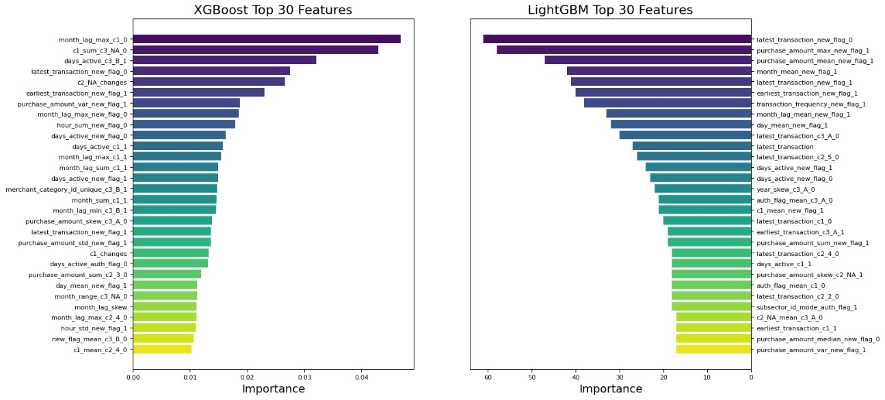
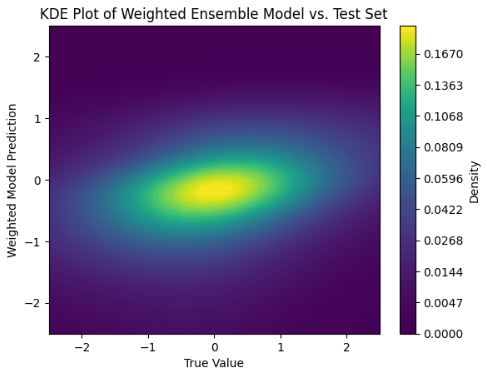

# ML-Consumer-Loyalty-Score
The Elo Merchant Category Recommendation dataset presents a predictive modeling challenge centered around forecasting customer loyalty scores for a group of merchants in Brazil. Elo, one of Brazil's leading payment brands, aims to identify and deliver personalized recommendations based on individual preferences throughout the customer lifecycle. The aim is to work with features like card transactions, merchant details, and customer interactions to develop machine-learning models, capable of accurately predicting “loyalty scores”. The objective of this Kaggle competition submission is to aid merchants in understanding and improving customer loyalty.
  

  
   

# Contributors

👨‍💻 **Quinn Booth** - `qab2004@columbia.edu`

👨‍💻 **Harsh Benahalkar** - `hb2776@columbia.edu`

👩‍💻 **Shan Hui** - `sh4477@columbia.edu`

👩‍💻 **Steven Chase** - `sc4859@columbia.edu`
  

# How to Run 

1) After cloning this repo, visit https://www.kaggle.com/competitions/elo-merchant-category-recommendation/ and download the Kaggle competition datasets into a 'Data' folder.
2) Run preprocessing.ipynb
3) Run feature_engineering.ipynb
4) Run feature_selection.ipynb
5) Run models.ipynb
  

# Table of Contents

- [Dataset](#dataset)
- [Method](#method)
    - [Preprocessing & Feature Engineering](#preprocessing)
    - [Baseline Models](#baseline)
    - [Feature Selection](#selection)
    - [Model Training](#training)
- [Evaluation & Final Kaggle Scores](#evaluation)
- [Limitations and Future Work](#future)
- [Conclusion](#conclusion)
- [References](#references)
  

# Dataset 

Multiple datasets, each focusing on cards, merchants, and transactions, form a crucial part of this analysis. To develop accurate models, it is necessary to aggregate these datasets. The datasets that are a part of this analysis are:

1) <b>train.csv:</b> The dataset comprises card information, with 'card_id' and 'first_active_month,' alongside anonymized features ('feature_1,' 'feature_2,' 'feature_3'). The 'target' column holds loyalty scores calculated two months post the historical and evaluation period.

2) <b>historical_transactions/new_merchant_transactions.csv:</b> Transactions include 'card_id,' 'merchant_id,' 'purchase_date,' 'authorized_flag,' 'category_1,' 'category_2,' 'category_3,' and 'installments.' Merchant-related data features 'merchant_id,' and revenue/quantity details for different periods (3, 6, 12 months). Location-related identifiers ('city_id', 'state_id', and 'subsector_id') are anonymized.

3) <b>merchants.csv:</b> Merchant-related information contains unique identifiers and anonymized measures. Categorical features are present, along with revenue and transaction quantities for different periods (3, 6, and 12 months). Location-related identifiers are anonymized.
  

# Method 

In the implementation of the Elo merchant category recommendation dataset, the main aim was to create a reliable predictive model, emphasizing the optimization of the Root Mean Squared Error (RMSE) as our performance gauge. Preprocessing steps on the dataset included addressing missing values, and sorting out categorical features. The data was then split into training and validation sets for a thorough model evaluation. Different machine learning algorithms such as Simple Regression, Light Gradient-Boosting Machine, and Neural Networks were implemented. The efficacy of the models was gauged by observing the RSME score of the models on the testing data.

As mentioned above, the evaluation metric used is the Root Mean Squared Error (RMSE). Performance is determined based on how well the predicted loyalty scores align with the actual loyalty scores assigned to each unique 'card_id.' 

### Preprocessing & Feature Engineering 

Condensing the corpus of time-series transactions into singular entries for each 'card_id' permits the use of traditional machine learning models and techniques. Doing this also removes a vast amount of information present in the time-series, hence the great importance of feature engineering in this machine learning exercise. historical_transactions.csv and new_merchant_transactions.csv were concatenated, leaving a flag marker 'new_flag' indicating which dataset a record originated from. Three features contained null values. Entries with missing 'merchant_ids' were dropped as there were relatively few. The null values of 'category_1' and 'category_3' were one-hot-encoded, along with the rest of the categorical variables. The datetime columns were also split into year, month, day and hour.

This accumulation of transaction records is now ready to be grouped by 'card_id'. To maintain as much information from the time-series as possible, many aggregations are taken. Before aggregation, the dataset had 30,910,695 entries and 25 features; our goal was to reduce the number of entries to unique card ids while generating many more features. In the end, this became 325,540 entries and 2836 features. The engineered features generally follow this naming scheme: feature_aggregation_boolean. For example, month_lag_max_c1_0 is the month_lag feature's maximum taken while c1 is fixed at 0 (False).

### Baseline Models 

To approach the task of predicting customer loyalty scores, a variety of regression models were explored. Using the features derived above the following models were trained with minimal feature selection or hyperparameter tuning: Linear Regression, Stochastic Gradient Descent, Random Forest, Neural Network, XGBoost, and LightGBM. 

* Neural Network RMSE = 11.82
* Linear Regression RMSE = 4.13
* SGD Regressor RSME = 3.88
* Random Forest RMSE = 3.85
* XGBoost RMSE = 3.81
* LightGBM RMSE = 3.72

Based on the results of running these models against the training data provided, we determined that XGBoost and LightGBM offered the most promise for optimizing towards the final best model. Moving forward, we will only be discussing the work done to optimize our XGBoost and LightGMB models.

### Feature Selection 

  
   
  <em>Figure 1: Top 30 features of each model selection with RFE.</em>

As important as feature engineering was, feature selection was also crucial to ensure our models captured as much information as possible without overfitting and sacrificing generalizability. Minimizing the dataset used also ensures that we can efficiently train our models which would be crucial in a production environment. For the XGBoost model, a few SHAP-hypertune methods were explored: Boruta, RFA, and RFE. Boruta is a feature selection method that uses a shadow feature creation approach to identify important features, while Recursive Feature Elimination (RFE) systematically removes the least important features based on model performance. Recursive Feature Addition (RFA) is a variant that adds features one at a time, ranking them by contribution to model performance. In addition, models with each set of features were then tuned using Bayesian Optimization resulting in the following:

* XGB Baseline RMSE = 3.811
* XGB with Boruta RMSE = 3.76
* XGB with RFE RMSE = 3.69
* XGB with RFA RMSE = 3.70

RFE and RFA returned similar results however, we decided to move forward with RFE for the XGBoost model as it used only 114 features compared to 750 features and still performed slightly better.

Feature selection for the LightGBM model was done similarly to RFE but without the use of libraries. First, the features were filtered based on their missing value rates, retaining only those with a missing rate of 0.4 or lower. Then further feature selection was performed in a step-wise elimination based on importance. Initially, all features were fitted using LightGBM to obtain their importance scores. These scores were then sorted and only the top 1500 features were retained. This process was repeated reducing from 1500 features to 1200, then to 1000, and finally to 800 features. The final LightGBM model was trained on these final 800 features. Figure 1 above shows the top 30 features for both models.

### Model Training 

The XGBoost and LightGBM models were trained using their respective features as described above. The XGBoost model was tuned using Hyperopt Bayesian optimization to find the optimal hyperparameters. For tuning the LightGBM model, we opted to use the Optuna library to assist with parameter optimization using cross-validation to determine the optimal parameters for the LightBGM model.
To increase the predictive power of the models, we decided to use them together in an ensemble method to make final predictions. For this, we trained four individual models; an XGBoost and LightGBM both trained on the XGBoost selected features as well as an XGBoost and LightGBM trained on the LightGBM selected features. This was in hopes of increasing generability and resulting in better predictions. All of these models were then optimized using Hyperopt Bayesian optimization to find optimal hyperparameters. These four models were tested on their own as well as combined into an ensemble through two methods. The first approach was averaging the results of the models. The second method was to weight the models to find the optimal combination. 
  

# Evaluation & Final Kaggle Scores 

Our optimal final model was a weighted ensemble that had the following weights corresponding to the order in the table: [0.32, 0.142, 0.434, 0.229]. These optimal weights were found using Nelder-Mead for optimization. Our best score on the Kaggle competition's hidden dataset was 3.713.

| Model              | Test RMSE | Kaggle Private | Kaggle Public |
|--------------------|-----------|-----------------|---------------|
| XGB on XGB RFE     | 3.709     | 3.640           | 3.724         |
| XGB on LGBM RFE    | 3.715     | 3.650           | 3.732         |
| LGBM on XGB RFE    | 3.705     | 3.637           | 3.719         |
| LGBM on LGBM RFE   | 3.714     | 3.648           | 3.728         |
| Average            | 3.702     | 3.635           | 3.728         |
| Weighted           | 3.698     | 3.636           | 3.713         |

Below is a kernel density plot of our most successful model, visualizing its predictions versus the true values.
  

    
    
<em>Figure 2: KDE Plot of Best Model.</em>

# Limitations and Future Work 

Firstly, due to the confinement of the implementation to a machine with limited resources, scalability issues arise when handling the extensively pre-processed and feature-engineered dataset (201,917 entries, 2841 features), and given the complex regression models requiring the same. Secondly, the focus on LightGBM and XGBoost would have inadvertently overlooked the tremendous potential advantages of exploring a broader array of better-performing machine learning algorithms (such as Neural Networks, albeit with a better network structure and heavily optimized hyperparameter tuning).

These limitations show a huge potential for improvement in the performance metrics when the computation capacity of the environment is improved. This would enable the model to perform better in terms of generalization and accuracy. Such improvements would lead to more accurate user-specific recommendations, which in turn would translate to higher sales for Elo. 

Looking ahead, there is a huge business opportunity to position the current Brazilian Elo Merchant Category Recommendation system for global scalability. To ensure compliance with highly diverse regulatory frameworks and data privacy standards that exist across borders globally, the implementation would have to incorporate region-specific considerations. This involves adjusting the model and infrastructure accordingly. Furthermore, establishing partnerships with regional financial conglomerates and merchant networks could offer valuable collaborations, enabling the Elo Merchant Category Recommendation system to collect data effectively. This expansion strategy aligns with Elo's roots as a Brazilian company while embracing the potential for a broader and more globally impactful presence.
  

# Conclusion 

In conclusion, this project aimed at developing predictive models for the Elo Merchant Category Recommendation successfully achieved its objectives. By leveraging advanced machine learning techniques, notably LightGBM and XGBoost, and employing robust parameter tuning methods with the aid of the Optuna library, we ensured that our models were both accurate and efficient. Our meticulous approach to feature engineering and the strategic use of model stacking led to outstanding results in the Elo Merchant Category Recommendation challenge. We attained an impressive average RMSE score of 3.698 on our test set. More notably, our models demonstrated remarkable performance on Kaggle's competitive platform, achieving a score of 3.63 on the private leaderboard and 3.71 on the public leaderboard.

The final models are capable of providing accurate merchant category recommendation scores, a critical need in the realm of personalized marketing and customer experience enhancement. The success of these models demonstrates the power of machine learning in transforming raw data into actionable insights, thereby offering significant value to similar business objectives.

Looking forward, the methodologies and insights gained from this project can be applied to similar problems in the retail and marketing domains. Continuous refinement and adaptation of these models with new data and emerging techniques will ensure their ongoing relevance and effectiveness. This project stands as a testament to the potential of data-driven solutions in addressing complex business challenges and driving innovation.
  

# References 

[1] Kaggle. Elo merchant category recommendation. pages 1–1, 2018. https://www.kaggle.com/competitions/elo-merchant-category-recommendation/

[2] TOWHIDUL.TONMOY. “🔥shap Hypertune🔥: Everything You Need to Know.” Kaggle, Kaggle, 1 Feb. 2022, https://www.kaggle.com/code/towhidultonmoy/shap-hypertune-everything-you-need-to-know/ 
  
